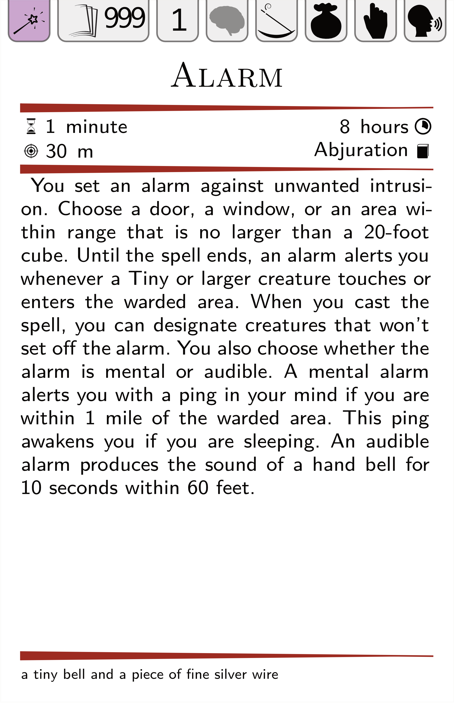

# Latex Spellcard generator

This script generates spellcard from a certain format of json.
There is an example in `data/sample.json`.

The cards are compact and could be printed on A4 (10 per page).

The end result looks like this:



## Calling

```
python genspells.py --spells data/sample.json -2 Wizard
```
